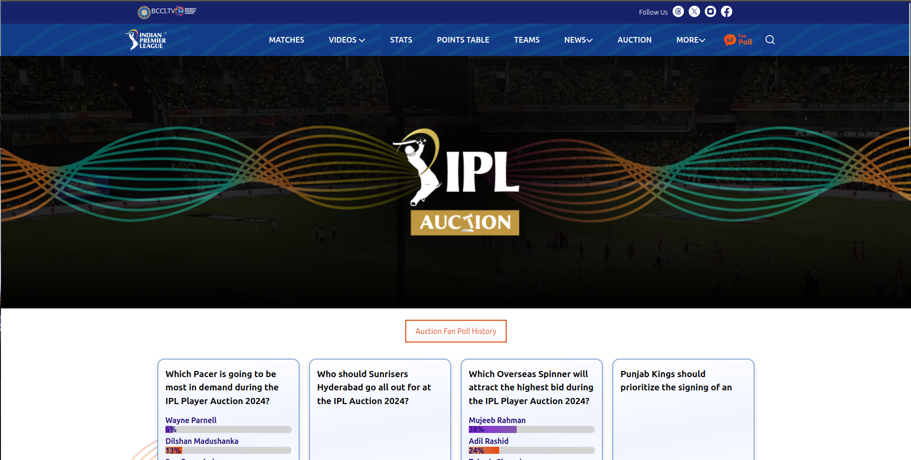
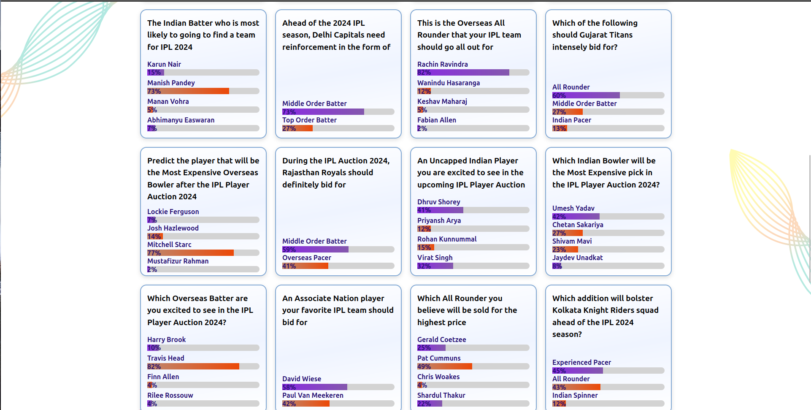
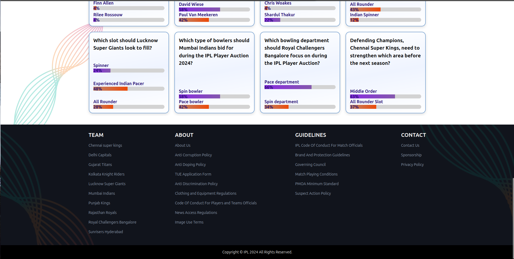

## IPL Fan Poll Page

**INTRODUCTION:**

The IPL FanPoll page is a platform for cricket fans to engage and participate in the Indian Premier League (IPL) by voting on various polls and surveys related to the league. These polls cover diverse topics, including:

- Player performance: Who will be the Player of the Tournament?
- Which batsman will score the most runs? Which bowler will take the most wickets?
- Team performance: Which team will win the IPL trophy? Which team will make it to the playoffs?
- Auction picks: Which players will be the most expensive buys at the auction? Which teams need specific players the most?
- Other cricket-related topics: What is your favorite IPL moment? Who is your favorite IPL player of all time?

**TECHNOLOGIES:**

1. HTML
HTML is a programming language which is used for structuring web Pages including headers, navigation bars, content sections, and footers.

2. CSS
Applied for styling and layout with different CSS properties.

3. TailWind CSS
Framework of CSS.

## Accessing the Help Page

## CHALLENGES

### 1. CONSISTENCY

- Maintaining consistency in coding styles, naming conventions, and overall structure is crucial.

### 2. VERSION CONTROL

- Handling version control with tools like Git helps prevent conflicts and allows for collaboration, but it requires careful management to avoid code conflicts.

### 3. BROWSER COMPATIBILITY

- Ensuring the website functions correctly across different browsers can be challenging due to varying levels of support for HTML, CSS, and JavaScript features.

### 4. RESPONSIVENESS

- Creating a responsive design that works well on different devices and screen sizes requires careful planning and testing.

### 5. TESTING AND DEBUGGING

- Rigorous testing and debugging are necessary to identify and fix issues promptly.

## CONCLUSION

Thank you for exploring the IPL FanPoll page in this repository. The page is designed responsively, ensuring a seamless experience across devices. Built with HTML and CSS, these pages deliver intuitive and informative content.

### Achievement:

- **Learning and Skill Development:**
  - This project has been a valuable learning experience in web development. We've honed our skills in HTML and CSS, allowing us to create responsive and visually appealing web pages.

